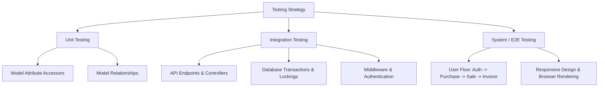

# Testing Strategy and Test Cases - Inventory Management System

This document outlines the testing strategy, test cases, and execution procedures for the Laravel (backend API & logic) + React/Inertia.js (frontend interface) inventory management application.

---

## 1. Testing Architecture & Stack

To ensure maximum reliability and maintainability, our testing strategy is split into three layers:



- **Unit Testing (Pest / PHPUnit)**: Focuses on isolated components (e.g., Eloquent models, validation logic, custom attributes, helper classes) without database overhead where possible.
- **Integration Testing (Pest Feature Tests)**: Tests combinations of components (controllers, requests, DB transactions, middleware, database state) to ensure they work together.
- **System Testing (Playwright / Cypress / Laravel Dusk)**: End-to-end (E2E) validation of the entire application stack, verifying React components rendering, user inputs, navigation, Inertia page loads, and PDF stream response downloads.

---

## 2. Unit Testing Cases

Unit tests target individual PHP classes (primarily Eloquent models) and verify their specific business logic in isolation.

### A. `Stock` Model Unit Tests

- **Test Case UT-ST-01**: **Reorder Level Status "No Need to Order"**
    - _Input_: `quantity = 10`, `reorder_level = 5`
    - _Expectation_: `status` attribute returns `'No Need to Order'`, `status_color` returns `'green'`.
- **Test Case UT-ST-02**: **Reorder Level Status "Ready to Order"**
    - _Input_: `quantity = 5`, `reorder_level = 5`
    - _Expectation_: `status` attribute returns `'Ready to Order'`, `status_color` returns `'yellow'`.
- **Test Case UT-ST-03**: **Reorder Level Status "Reorder Needed"**
    - _Input_: `quantity = 2`, `reorder_level = 5`
    - _Expectation_: `status` attribute returns `'Reorder Needed'`, `status_color` returns `'red'`.

### B. `User` Model Unit Tests

- **Test Case UT-US-01**: **User-Role Association**
    - _Input_: User created with `role_id` pointing to an `admin` role in the database.
    - _Expectation_: `$user->role->role_name` returns `'admin'`.
- **Test Case UT-US-02**: **hasRole Helper - True match**
    - _Input_: User has `'admin'` role; check `$user->hasRole('admin')`.
    - _Expectation_: Returns `true`.
- **Test Case UT-US-03**: **hasRole Helper - False match**
    - _Input_: User has `'admin'` role; check `$user->hasRole('storekeeper')`.
    - _Expectation_: Returns `false`.

### C. `Product` Model Relationships

- **Test Case UT-PR-01**: **Product belongs to Category**
    - _Expectation_: Calling `$product->category` returns the associated `Category` instance.
- **Test Case UT-PR-02**: **Product belongs to Supplier**
    - _Expectation_: Calling `$product->supplier` returns the associated `Supplier` instance.
- **Test Case UT-PR-03**: **Product has one Stock record**
    - _Expectation_: Calling `$product->stock` returns the associated `Stock` instance.

---

## 3. Integration Testing Cases

Integration tests run with a test database (using `RefreshDatabase` to reset state between tests) and simulate HTTP requests to controller routes.

### A. Product Management (Role-Based Access Control)

- **Test Case IT-PR-01**: **Guest Access Blocked**
    - _Action_: Guest attempts to GET `/products` or POST `/products`.
    - _Expectation_: User is redirected to `/login`.
- **Test Case IT-PR-02**: **Insufficient Role Permissions (Staff)**
    - _Action_: User logged in with `staff` role attempts to GET `/products` or POST `/products`.
    - _Expectation_: HTTP response status `403 (Forbidden)`.
- **Test Case IT-PR-03**: **Sufficient Role Permissions (Storekeeper/Admin)**
    - _Action_: User logged in with `storekeeper` or `admin` role attempts to GET `/products`.
    - _Expectation_: HTTP response status `200 (OK)` returning Inertia rendering of `products/index`.
- **Test Case IT-PR-04**: **Product Creation with Stock Initialization**
    - _Action_: `admin` posts valid parameters (name, sku, category_id, supplier_id, prices, reorder_level) to `/products`.
    - _Expectation_: Product record is created in the database and a corresponding `Stock` record is automatically initialized with `quantity = 0`.

### B. Purchase Workflow (Stock IN)

- **Test Case IT-PU-01**: **Successful Stock Increment**
    - _Action_: Authenticated user posts a purchase with items (Product ID, quantity).
    - _Expectation_: Stock quantity for the product is incremented by the purchased quantity, a new purchase record is created, and the total purchase amount is correctly calculated.
- **Test Case IT-PU-02**: **Product-Supplier Alignment Check**
    - _Action_: User posts a purchase specifying Supplier X, but lists a product belonging to Supplier Y.
    - _Expectation_: Transaction fails, database changes are rolled back, and an error message is returned in the session.
- **Test Case IT-PU-03**: **Purchase Deletion Stock Recovery**
    - _Action_: Admin deletes an existing purchase.
    - _Expectation_: Stock quantities are decremented by the quantities from the deleted purchase, and the purchase record is removed.

### C. Sale Workflow (Stock OUT)

- **Test Case IT-SA-01**: **Successful Stock Decrement**
    - _Action_: User sells a product with sufficient stock.
    - _Expectation_: Stock quantity is decremented, a sale record is created, and user is redirected with success.
- **Test Case IT-SA-02**: **Prevent Negative Stock (Insufficient Quantity)**
    - _Action_: User attempts to sell quantity = 15 when available stock is 10.
    - _Expectation_: Transaction fails, error is set in session, and stock remains unchanged.
- **Test Case IT-SA-03**: **Prevent Sale of Out of Stock Products**
    - _Action_: User attempts to sell a product with stock quantity = 0.
    - _Expectation_: Transaction fails, error is set in session.
- **Test Case IT-SA-04**: **Prevent Sale of Product with Undefined Unit Price**
    - _Action_: Product unit price is set to 0. User attempts to sell it.
    - _Expectation_: Transaction fails because price is not set, preventing zero-value sales.
- **Test Case IT-SA-05**: **Sale Deletion Stock Restoration**
    - _Action_: Admin deletes a sale of quantity = 5.
    - _Expectation_: Stock quantity is incremented by 5, restoring original stock levels.

---

## 4. System (End-to-End) Testing Cases

System tests validate the entire flow from a real user's perspective, simulating browser clicks, form submissions, page redirection, and UI updates.

### E2E Flow Matrix: Complete Inventory Lifecycle

| Test Case ID  | Test Stage          | Action                                                                                                             | Expected Result                                                                                             |
| ------------- | ------------------- | ------------------------------------------------------------------------------------------------------------------ | ----------------------------------------------------------------------------------------------------------- |
| **ST-E2E-01** | Authentication      | Go to `/`, login with valid admin credentials.                                                                     | Dashboard renders, showing stats like "Total Products", "Low Stock", etc.                                   |
| **ST-E2E-02** | Category Creation   | Navigate to `/categories`, open modal, fill "Electronics", save.                                                   | Success notification shown, "Electronics" appears in category list.                                         |
| **ST-E2E-03** | Supplier Creation   | Navigate to `/suppliers`, open modal, fill "Alpha Suppliers", save.                                                | Success notification, supplier row appears.                                                                 |
| **ST-E2E-04** | Product Creation    | Navigate to `/products`, open modal, fill details (SKU: "E-LAP-1", Supplier: "Alpha Suppliers", Reorder: 5), save. | Success notification. Product row displays with "0 Quantity" and status "Reorder Needed" (Red).             |
| **ST-E2E-05** | Stock In (Purchase) | Navigate to `/purchases`, open form, select "Alpha Suppliers", select "E-LAP-1", enter qty: 10, submit.            | Redirected to purchase list. Product quantity shows 10. Stock status updates to "No Need to Order" (Green). |
| **ST-E2E-06** | Stock Out (Sale)    | Navigate to `/sales`, open form, select "E-LAP-1", qty: 4, submit.                                                 | Redirected to sales list. Stock quantity decreases to 6.                                                    |
| **ST-E2E-07** | Invoice Generation  | View invoice for the sale made in ST-E2E-06. Click "Download PDF".                                                 | PDF document opens/downloads displaying correct itemized invoice details.                                   |

---

## 5. Execution Guide

### Running Unit & Integration Tests (Pest)

To run the automated PHP unit and integration test suite, execute the following command in the application's root directory:

```bash
# Run all tests
php artisan test

# Run only Unit tests
php artisan test --testsuite=Unit

# Run only Feature (Integration) tests
php artisan test --testsuite=Feature
```

### Implementing E2E System Tests (Example with Playwright)

E2E testing is best achieved using a modern node library like Playwright. Here is a sample code setup to automate the **ST-E2E-01** (Auth) and **ST-E2E-02** (Category creation) system tests.

1. **Install Playwright**:

    ```bash
    npm install --save-dev @playwright/test
    npx playwright install
    ```

2. **Create Test File** (`tests/e2e/inventory.spec.ts`):

    ```typescript
    import { test, expect } from '@playwright/test';

    test.describe('Inventory System E2E Flow', () => {
        test('can login and create a category', async ({ page }) => {
            // 1. Login
            await page.goto('http://localhost:8000/login');
            await page.fill('input[type="email"]', 'admin@example.com');
            await page.fill('input[type="password"]', 'password');
            await page.click('button[type="submit"]');

            // Verify dashboard landing
            await expect(page).toHaveURL('http://localhost:8000/dashboard');
            await expect(page.locator('text=Total Products')).toBeVisible();

            // 2. Navigate to Categories and Create one
            await page.click('a[href="/categories"]');
            await page.click('button:has-text("Add Category")');
            await page.fill('input[name="name"]', 'New E2E Category');
            await page.click('button:has-text("Save")');

            // Verify creation in UI list
            await expect(page.locator('text=New E2E Category')).toBeVisible();
        });
    });
    ```

3. **Execute E2E Tests**:

    ```bash
    # Run in headless mode
    npx playwright test

    # Run with UI mode for debugging
    npx playwright test --ui
    ```
